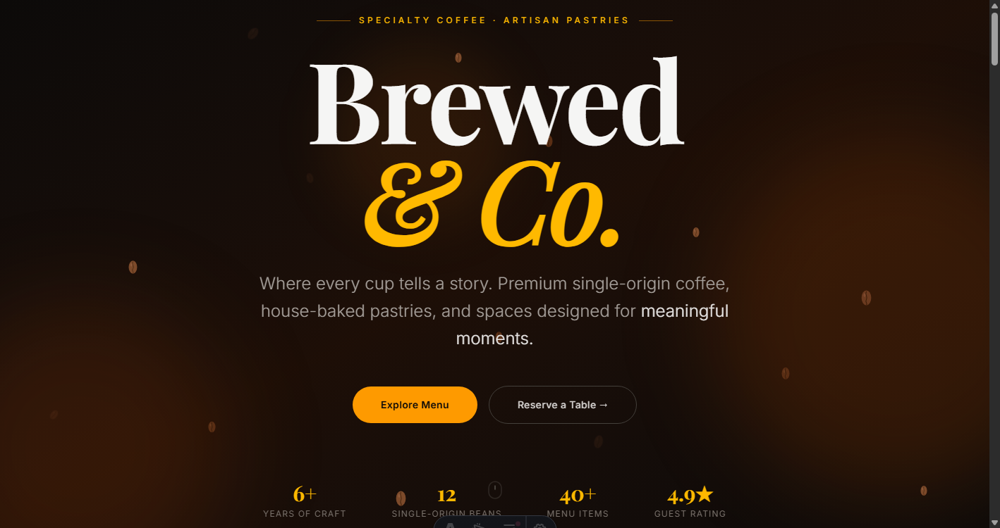
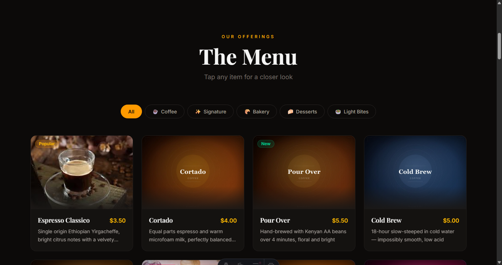
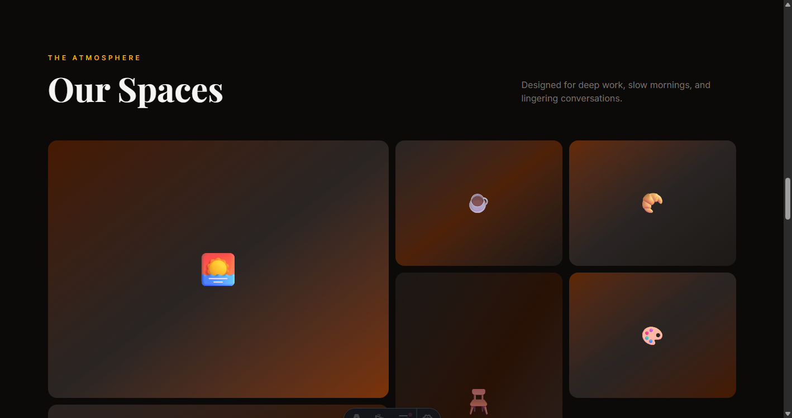
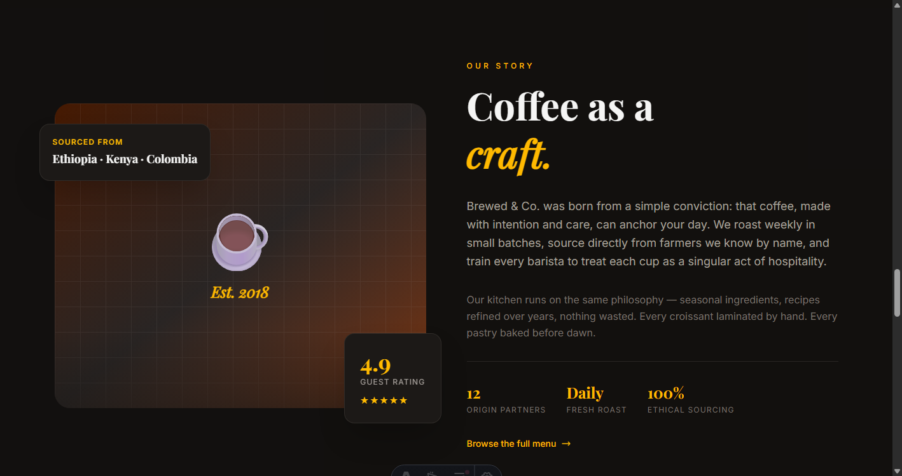
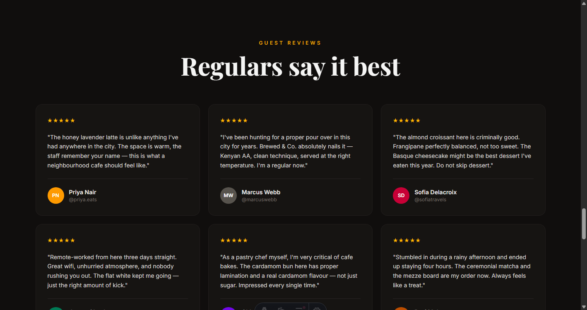
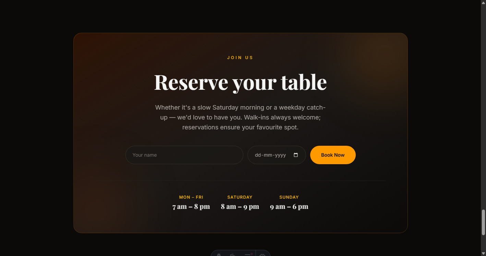

# Brewed & Co. — Premium Artisan Cafe Demo

A fully interactive cafe website built with **Astro v6** and **Tailwind CSS v4**. Features rich animations, a filterable menu with FLIP card previews, 3-D card tilt effects, and a dark premium aesthetic throughout.

---

## Screenshots

### Hero


### Menu


### Gallery


### Our Story


### Guest Reviews


### Reservation


---

## Tech Stack

| Layer | Tool |
|---|---|
| Framework | [Astro v6](https://astro.build) |
| Styling | [Tailwind CSS v4](https://tailwindcss.com) (Vite plugin) |
| Fonts | Playfair Display · Inter (Google Fonts) |
| Animations | Vanilla JS + CSS keyframes |
| Images | Generated via `sharp` (Astro transitive dep) |
| Language | TypeScript |

---

## Features

- **FLIP card preview** — clicking any menu card animates it to a full-screen overlay using the First/Last/Invert/Play technique; no layout thrash, GPU-composited
- **3-D card tilt** — mouse-tracking perspective tilt with a specular shine layer on every menu card
- **Floating coffee beans** — CSS-only ambient animation in the hero background using per-bean custom properties (`--drift`, `--op`, `--sr`, `--er`)
- **Category filter** — tab bar filters the menu grid with a re-triggered `fadeInUp` entry animation on each reveal
- **Lazy image reveal** — photos fade in with a subtle zoom using inline-style transitions (immune to Tailwind class specificity conflicts)
- **Scroll-smooth navigation** — all section anchors use native CSS `scroll-behavior: smooth`
- **Responsive layout** — 1 → 2 → 3 → 4 column menu grid; mobile-first throughout
- **Custom favicon** — SVG coffee cup + multi-resolution `.ico` (16 / 32 / 48 px)

---

## Project Structure

```
cafe-demo/
├── public/
│   ├── favicon.svg          # SVG favicon (coffee cup)
│   ├── favicon.ico          # Multi-res ICO (16/32/48px)
│   └── images/menu/         # 19 generated JPEG menu photos
├── scripts/
│   ├── generate-menu-images.mjs   # Generates menu JPEGs via sharp
│   ├── generate-favicon-ico.mjs   # Builds favicon.ico from SVG
│   └── screenshot.mjs             # CDP-based section screenshots
├── src/
│   ├── components/
│   │   ├── Hero.astro
│   │   ├── MenuSection.astro  # FLIP overlay + category filter
│   │   ├── MenuCard.astro     # 3-D tilt + image reveal
│   │   ├── Gallery.astro
│   │   ├── Story.astro
│   │   ├── Testimonials.astro
│   │   ├── CTA.astro
│   │   └── Footer.astro
│   ├── data/
│   │   └── menu.ts            # 19 menu items across 5 categories
│   ├── layouts/
│   │   └── Layout.astro
│   ├── pages/
│   │   └── index.astro
│   └── styles/
│       └── global.css         # @theme tokens + keyframes
├── astro.config.mjs
└── tsconfig.json
```

---

## Getting Started

```bash
# Install dependencies
npm install

# Start dev server
npm run dev

# Build for production
npm run build

# Preview production build
npm run preview
```

### Regenerate assets (optional)

```bash
# Regenerate the 19 menu placeholder images
node scripts/generate-menu-images.mjs

# Regenerate favicon.ico from public/favicon.svg
node scripts/generate-favicon-ico.mjs
```

---

## Menu Categories

| Category | Items |
|---|---|
| ☕ Coffee | Espresso Classico, Cortado, Pour Over, Cold Brew, Flat White |
| ✨ Signature | Honey Lavender Latte, Golden Turmeric Latte, Rose Cardamom Chai, Ceremonial Matcha |
| 🥐 Bakery | Butter Croissant, Almond Croissant, Cardamom Bun, Sourdough Toast |
| 🍰 Desserts | Espresso Tiramisu, Basque Burnt Cheesecake, Brown Butter Financier |
| 🥗 Light Bites | Smashed Avocado Toast, Quiche Lorraine, Mezze Board |
